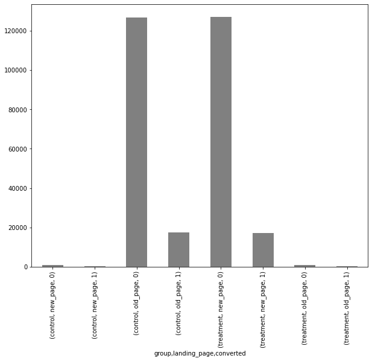
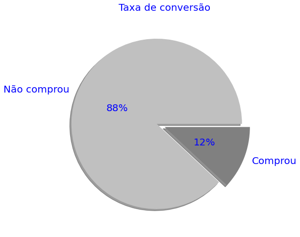
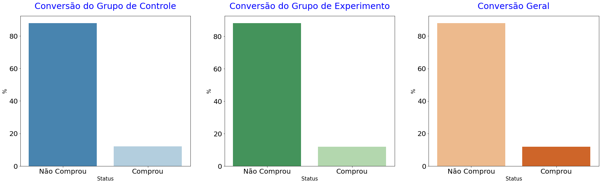

# Luiz-Portfolio
Meu portfolio de Data Science

Acesse meu [repositório de projetos em data science](https://github.com/Luiz-Faro/Projetos-Data-Science) para conhecer todos os projetos!

# [Projeto 1: Clusterizando Clientes de Crédito com K-means](https://github.com/Luiz-Faro/Projetos-Data-Science/blob/main/Clustering_Kmeans-checkpoint.ipynb)

Neste projeto de clusterização de clientes de cartão de crédito, utilizei o método não supervisionado K-Means para agrupá-los com o objetivo de facilitar o desenho de estratégias focadas nesses clientes. Para entender melhor o perfil de cada cliente, fiz a clusterização e identifiquei qual é o perfil médio de dos clientes de cada cluster.

O trabalho passou pelas seguintes etapas:

Tratamento dos dados e observação das estatísticas descritivas e distribuições dos dados;
Tratamento de outliers caso necessário;
Transformação para padronização dos dados;
Clusterização com o método do cotovelo para definir o número de clusters;
Utilização de boxplots para entender os perfis dos clusters e caracterizá-los.
Foram utilizadas bibliotecas como numpy, pandas, matplotlib.pyplot, seaborn, scikit-learn. O dataset utilizado foi obtido no Kaggle e apresentou menos de 4% de valores vazios, que foram eliminados. Para o tratamento de outliers, o critério utilizado foi selecionar somente até o percentil 95 de algumas colunas.

O projeto resultou em uma matriz de correlação, que apresentou correlações positivas e negativas entre as variáveis analisadas, e boxplots que permitiram a identificação dos perfis dos clientes em cada cluster.

## Aprofundado análise do projeto (EDA)

Na etapa de EDA, foi possivel identificar a correlação das features do data set: 

Com isso destacam-se 3 features mais relevantes dado seu nível de correlação: 
> Balanço /
> Credito /
> Compras

Dessa forma o foco da análise será volto para a composição dessas features, que podem ser avalidas de maneira independente de acordo com sua frequência: 

### Balanço

### Credito

### Compras

De uma maneira geral, os dados estão distribuidos com a maior frequencia próximas ao ponto 0 do eixo x o que pode nos auxiliar a entender qual a característica da maioria dos clientes. 

## Agrupamento dos Similares e Método do Cotovelo 

nesse contexto, o método do cotovelo é uma técnica utilizada para identificar o número ideal de clusters em uma análise de clusterização. A ideia por trás desse método é observar a relação entre a variância explicada e o número de clusters utilizados na análise.

No código em questão, após realizar a transformação dos dados para padronização, é realizada a clusterização utilizando o método K-Means com um loop que varia o número de clusters de 1 a 10. Em cada iteração, é calculada a distorção média ao quadrado (MSE) de cada cluster, que representa a distância média entre os pontos do cluster e o seu centroide.

Em seguida, é criado um gráfico de linha mostrando a relação entre o número de clusters e a distorção média ao quadrado. O ponto de inflexão na curva é conhecido como "cotovelo" e indica o número ideal de clusters para a análise.

No case em questão, podemos observar que o número ideal de clusters é 4, pois após esse ponto o ganho de informação é relativamente pequeno em comparação com o número de clusters adicionais utilizados. Esse resultado pode ser observado visualmente na figura gerada pelo código.

Assim, o método do cotovelo é uma técnica importante para auxiliar na escolha do número ideal de clusters, permitindo uma análise mais precisa e significativa dos dados.

## Identificação dos Clusters

Com base na análise realizada usando o método do cotovelo para identificar o número ideal de clusters, podemos concluir que existem 4 grupos distintos de clientes com base em suas compras em nossa loja virtual.

### Balanço

### Crédito

### Compras

Ao analisar os clusters e as descrições de cada variável, identificamos diferenças entre as populações em algumas variáveis, o que nos permite criar 4 perfis distintos. É importante observar que há presença de outliers quando comparamos entre os clusters.

Os 4 perfis identificados são:

Cliente Contido (Cluster 0): Não realiza compras em grandes valores, quantidades ou pagamento antecipado.

Cliente Comprador (Cluster 1): Realiza compras em grandes valores e quantidades, porém não realiza pagamento antecipado.

Cliente em Ascensão (Cluster 2): Está começando a aumentar suas compras, porém ainda realiza compras em quantidades normais e não realiza pagamento antecipado.

Cliente Não Devedor (Cluster 3): Similar ao Cliente Contido, porém realiza pagamento antecipado em todas as suas compras.

Essa descrição é útil em áreas não técnicas, como atendimento ao cliente, marketing, vendas e financeiro, pois fornece detalhes relevantes sobre a população que podem ser úteis para o negócio, sem a necessidade de analisar todas as contas individualmente

# [Projeto 2: Utilizando Teste A|B para avaliar a taxa de conversão de uma nova página na web](https://github.com/Luiz-Faro/Projetos-Data-Science/blob/main/teste_a_b_Web_Pages.ipynb)

### Teste A|B
Teste A|B é um teste  que divide o acesso a uma página online ou produto em duas versões diferentes, A(controle) e B(experimento), e depois mede-se a taxa de conversão que podem ser  vendas, clicks, preferência, compartilhamentos entre outras. As diferenças nas páginas/produtos podem ser em cores, botões, chamadas para ação ou serem totalmente diferentes mas com o mesmo objetivo. 

Suas aplicações são comuns em e-commerce e anúncios como Google Ads, Redes Sociais, email marketing e landing pages. Também é usado na indústria para lançamento de versões produtos para avaliar cores, tamanho e forma. Mesmo com aparência simples não é fácil encontrar variáveis estatísticamente relevantes  para o experimento, isto é, é necessário grande quantidade de dados e tempo para rodar o teste, neste artigo melhor detalhado o uso dos Testes A|B:[O que é Teste A|B.](https://resultadosdigitais.com.br/blog/o-que-e-teste-ab/)

Embora possa parecer simples deve ser cuidadosamente projetado para obter resultados conclusivos e evitar enviesamento como descrito nest artigo em inglês [7 A/B Testing Questions and Answers in Data Science Interviews](http://https://towardsdatascience.com/7-a-b-testing-questions-and-answers-in-data-science-interviews-eee6428a8b63), que faz um apanhado da teoria do Teste A|B como questões de entrevista de emprego.

- Para aprofundar no assunto super recomendo o podcast hipsters tech com o time da NetShoes e o material da página. Você pode acessar [aqui.](https://hipsters.tech/testes-ab-hipsters-59/).

- [Experiments at Airbnb](https://medium.com/airbnb-engineering/experiments-at-airbnb-e2db3abf39e7) - Um estudo de caso do Airbnb que mostra as armadilhas do Teste A|B e como evitar.
- [What is A|B Testing?](https://www.momentcrm.com/blog/what-is-ab-testing/)
- [5 Common Threats to Your A/B Test’s Validity](https://instapage.com/blog/validating-ab-tests)
- [A/B Testing Statistics: An Easy-to-Understand Guide](https://cxl.com/blog/ab-testing-statistics/)

## Aprofundado análise do projeto (EDA)

### Histórico de acesso as páginas
Primeiramente vamos verificar como os usuários navegam entre as páginas da web: 

Depois vamos verificar se a proporção em cada grupo é similar, isto é, se a amostra está balanceada. Amostras desbalanceadas podem levar a enviesamento dos dados, por isso é importante ter uma representividade semelhante.

### Taxa de conversão

Depois de avaliar a proporção do grupo, é possível medir a taxa de conversão de todos os usuários da base, entre pessoas que compraram e não compraram produtos: 

### Com base neste racional podemos fazer o mesmo comparativo agora entre os grupos de: 
> Controle | Experimento | Geral

Visualmente não dá para notar muitas diferenças nos grupos, parecem que se comportam do mesmo modo. E estatísticamente?
com base nos artigos recomendados anteriormente, perceberás que esse tipo de situação é mais comum do que se imagina por isso o Teste A|B é tão importante.

### Teste A|B com chi quadrado
Chi-Quadrado, também conhecido como coeficiente de Pearson é um teste estatístico para comparar duas variáveis categóricas, independentes entre com pelo menos 5 observações. O teste verifica se as variáveis são homogêneas entre si.

A interpretação é realizada por meio de comparação com o p-value que , por convenção,abaixo de 0,05 há evidências de diferenças entre os grupos e acima disso não há diferenças significativas.

0. *H0* ou Hipótese nula - não há fiferença estatistica entre as variáveis, p > 0,05.
1. *H1* ou Hipótese Alternativa - Há diferença esstatística entre as variáveis, p < 0,05.

Abaixo deixo 1 artigo em português e 3 em inglês para melhor compreensão do assunto. Vale a pena a leitura!

[Teste Chi Quadrado de Pearson: um guia completo](https://sosestatistica.com.br/teste-chi-quadrado-pearson/#:~:text=O%20teste%20Chi%20Quadrado%20de,%C3%972%20(ou%20maiores).)

[Chi-Squared Test for Feature Selection with implementation in Python](https://towardsdatascience.com/chi-squared-test-for-feature-selection-with-implementation-in-python-65b4ae7696db)

[The Chi-Squared Test Statistic is a Must For Every Data Scientist: A Case Study in Customer Churn](https://towardsdatascience.com/the-chi-squared-test-statistic-is-a-must-for-every-data-scientist-a-case-study-in-customer-churn-bcdb17bbafb7)

[Ace the Interview: Chi-Squared Test](https://towardsdatascience.com/ace-the-interview-the-chi-squared-test-e6d37f681ea4)

### Teste Chi-Quadrado

A função chi_contingence da biblioteca retorna 4 valores: chi_2, p_value, graus de liberdade e frequência esperada.

[Biblioteca](https://docs.scipy.org/doc/scipy/reference/generated/scipy.stats.chi2_contingency.html)

> Output do teste: "significância=0.05, p_value=0.17, chi_2=1.88
Não há diferenças entre as páginas,as variáveis são homogêneas. (aceitamos H0)"

Tal resultado significa que não há diferenças estatísticas nas conversões da pagina antiga e a página nova. 
